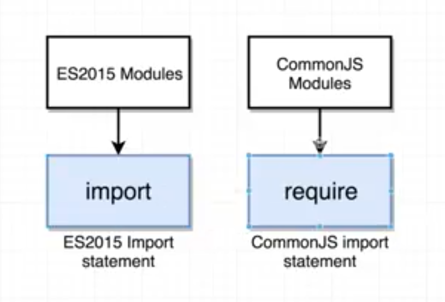

## 1. Import the React and ReactDOM libraries
```js
// ES2015 Modules
import React from 'react';
import ReactDOM from 'react-dom';
```


```js
// CommonJS Modules
const React = require('react');
```



## 2. Component?
1. show HTML using JSX
2. handle feedback using Event Handler


### Three Tenets of Component

#### 1) Component Nesting
#### 2) Resuability
#### 3) Component Configuration


### Re-usable Component


### import-export component


## Prop System 
: parent component -- passing data --> child component
- Goals?
  - to customize
  - configure a child component


1. providing information from parent component
2. consuming information in child component